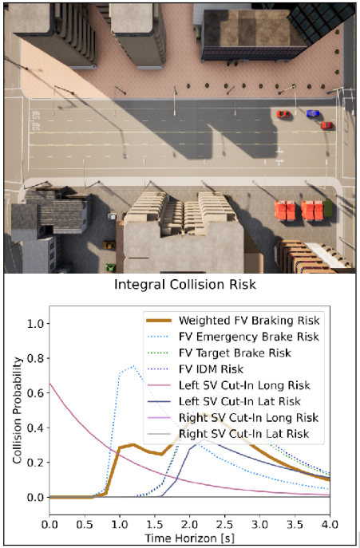

# Dynamic Bayesian Risk Assessment for Autonomous Vehicle Safety

## Overview

This project implements a dynamic Bayesian Network-based risk assessment system for autonomous vehicle safety using the CARLA simulator. The system dynamically predicts the risks posed by surrounding vehicles (forward, left-side, and right-side) in various driving scenarios by monitoring their behavior and environmental conditions in real-time.

The system calculates probabilistic risk levels for scenarios such as:
- Forward Vehicle Braking
- Left and Right Vehicle Cut-In
- Sensor Uncertainty due to environmental conditions

The overall goal is to allow autonomous vehicles (AVs) to perform real-time risk assessments, adjusting their driving behavior dynamically to ensure optimal safety and reliability.

## Requirements

1. **CARLA 0.9.10.1** 
   - Download the CARLA 0.9.10.1 simulator: [CARLA Download](https://github.com/carla-simulator/carla/releases/tag/0.9.10.1)
   
2. **Python Version**
   - Python 3.7 or later

3. **Libraries**
   Install the following required libraries using pip:
   ```bash
   pip install matplotlib numpy carla==0.9.10


# Setup

## CARLA Installation

1. Download and extract CARLA 0.9.10.1.
2. Start the simulator by navigating to the CARLA directory and running the following command:

   ```bash
   ./CarlaUE4.sh
   ```

## Clone this Repository

1. Clone the repository into your working directory:

   ```bash
   git clone [your-repo-url]
   cd [your-repo-directory]
   ```

## Install Required Libraries

1. Install all necessary dependencies:

   ```bash
   pip install -r requirements.txt
   ```

# Running the System

## Start the CARLA Simulator

1. Ensure CARLA is running on your local machine. Use the command:

   ```bash
   ./CarlaUE4.sh
   ```

## Run the Sinadra Risk Sensor Client

1. This client collects risk-related sensor data from the CARLA simulation:

   ```bash
   python3 implementation/sinadra_risk_sensor_client.py
   ```

## Run a Scenario

1. Next, run a pre-defined scenario using the `scenario_runner.py` script. Replace `[xosc scenariofile name]` with the name of your desired OpenSCENARIO (.xosc) file:

   ```bash
   python3 scenario_runner/scenario_runner.py --openscenario [xosc scenariofile name]
   ```

2. Example:

   ```bash
   python3 scenario_runner/scenario_runner.py --openscenario examples/Town03_CrossingPedestrians.xosc
   ```

# Files and Directory Structure

- `implementation/`: Contains the Sinadra risk sensor client and dynamic Bayesian Network system implementations.
  - `sinadra_risk_sensor_client.py`: Script to run the client for risk data collection.
- `scenario_runner/`: Scripts related to running scenarios in CARLA.
  - `scenario_runner.py`: Main runner script for loading and executing CARLA scenarios.
- `config/`: Configuration files used by the Bayesian Network and risk prediction system.
- `results/`: Stores the output from each run, including logs and risk data.

## Scenario Files

The system supports various OpenSCENARIO (.xosc) files that can simulate different autonomous driving situations. Ensure your scenario files are placed in the appropriate directory for them to be accessible.

# Risk Plots


# Risk Assessment Output

The system generates risk predictions in real-time, displayed on a dynamic risk plot. The X-axis represents time (in seconds), while the Y-axis represents the collision probability (ranging from 0 to 1). The output also includes different risk components, such as forward vehicle braking, side vehicle cut-in risks, and environmental uncertainty.

# Conclusion

This project allows for the real-time dynamic risk assessment of autonomous vehicles using a Bayesian Network, improving the vehicle's decision-making process in complex environments. You can modify the configuration parameters and scenarios to explore different conditions and behaviors.
